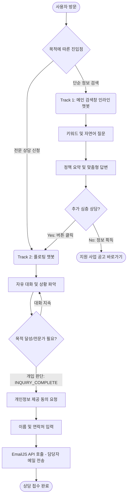

# 지능형 공공서비스 AI 가이드 (ChatSpark Demo)

이 프로젝트는 소상공인을 대상으로 **OOOO패키지 지원사업(데모)**을 안내하고 상담하는 검색 기반 AI 가이드 서비스입니다. 바닐라 웹 기술(HTML/CSS/Vanilla JS)과 Vercel 서버리스 함수, 그리고 Google Gemini AI를 결합하여 설계된 'Search-First UX' 기반의 모던 웹 애플리케이션입니다.

## 🚀 실시간 데모 (Demo)
👉 **[ChatSpark AI](https://tdsg-ax.github.io/selim_chatSpark)**

---

## 📐 핵심 특징 (Features)

1. **Search-First UX:** 사용자가 거부감을 느끼는 기존의 플로팅 챗봇을 넘어, 메인 검색창에서 바로 인라인 AI 대화가 전개되는 직관적인 검색-채팅 통합 경험을 제공합니다.
2. **Context-First Prompting:** 시스템 프롬프트에 '짧은 대화와 맥락 파악'을 강제하여, 이름이나 연락처를 무작정 묻지 않고 2~3번의 가벼운 질문을 통해 상황을 먼저 파악합니다.
3. **Smart Breakout & Lead Capture:** AI가 상담원 개입이 필요하다고 판단하면(`[INQUIRY_COMPLETE]`), 자연스럽게 이메일 폼을 통해 전문 상담사 연결(리드 수집)을 유도합니다.
4. **Actionable Links:** 설명에 그치지 않고, AI가 적절한 지원사업 공고 링크를 클릭 가능한 버튼(`<a href="...">`) 형태로 직접 렌더링합니다.

---

## 🗂️ 파일 구조
```
selim_chatSpark/
├── index.html          # [NEW] 메인 랜딩 페이지 (Search-First UX, TailwindCSS)
├── chat-widget.css     # 플로팅 챗봇 UI 전용 스타일시트 (Tailwind 충돌 방지)
├── script.js           # 플로팅 챗봇 로직 & 리드 수집 상태 관리 머신
├── CONVERSATIONAL_GUIDE.md # 챗봇 대화 설계 원칙 및 정책 문서 (RAG 제외, Prompt 내재화)
├── base01~04.md        # AI 챗봇의 지식 베이스 문서 (RAG 검색 대상)
├── api/
│   ├── chat.js         # Gemini AI 연동 서버리스 API (System Prompt, BM25 포함)
│   ├── send-email.js   # 리드 수집 시 EmailJS 등 이메일 발송 릴레이 API
│   └── lib/
│       └── search.js   # BM25 기반 초경량 한국어 검색 엔진 (메모리 상주형)
└── README.md           # 이 문서
```

---

## 🔍 지식 베이스 검색 엔진 (BM25)

본 프로젝트는 고비용의 벡터 DB 없이도 소규모 지식 베이스에서 최적의 성능을 낼 수 있도록 **메모리 상주형 BM25 검색 로직**을 자체 구현하였습니다.

### ⚙️ 동작 원리
- **실시간 인덱싱**: 서버(Vercel Function)가 구동될 때마다 `.md` 파일을 읽어 RAM에 검색 인덱스를 생성합니다.
- **한국어 최적화**: 공백 기반 단어 검색과 횡단 2-gram(단어 내 글자 단위 조합)을 병행하여 띄어쓰기 오차에도 강건합니다.
- **인용 기반 답변**: 질문과 가장 관련 있는 Top-5 문단을 추출하여 Gemini AI의 Context로 주입하고 출처를 표기합니다.

### 📏 권장 데이터 규모
현재 아키텍처는 **소규모~중규모** 지식 베이스에 최적화되어 있습니다.
- **권장 규모**: A4 용지 기준 **50장 이내** (텍스트 데이터 약 100KB~500KB)
- **성능**: 위 규모 내에서는 인덱싱 및 검색 속도가 **0.01초(10ms)** 이내로 매우 빠릅니다.
- **확장 가이드**: 문서량이 A4 100장 이상으로 늘어날 경우, '빌드 시점 정적 인덱싱'이나 전문 벡터 DB(예: Pinecone) 도입을 권장합니다.

---

## 🤖 AI 하이브리드 대화 흐름 (2-Track Workflow)
동일한 지식 베이스(BM25)와 AI 모델(Gemini)을 활용하되, 사용자의 진입점과 목적에 따라 두 가지 뚜렷한 프로세스 경험 지도를 지원합니다.



### Track 1. 지원대상 서비스 AI 검색 (인라인 챗봇)
메인 화면의 중앙 검색창을 통해 진입하며, 궁금한 점을 즉시 해소하는 데 목적을 둡니다.
1. **검색 및 맥락 파악:** 사용자가 검색어를 입력하면 관련된 정책 정보를 즉각 요약하여 답변.
2. **서비스 추천:** 몇 번의 짧은 문답 후, 사용자에게 가장 적합한 지원사업의 [바로가기 링크] 제공.
3. **상담사 연결 유도:** 대화 중 딥다이브가 필요해지면 자연스럽게 하단의 전문 상담 접수(Track 2)로 안내.

### Track 2. 전문 상담을 위한 상담 접수 (플로팅 챗봇)
우측 하단의 [전문 상담 접수] 버튼을 통해 진입하며, 구체적인 리드(Lead) 수집과 담당자 연결에 목적을 둡니다.
1. **STEP 1 (상담 진행):** AI가 심층적인 상황 파악 및 자유 상담 진행
2. **STEP 2 (개인정보 동의):** 일정 대화 후, 상세 상담을 위한 개인정보 수집 동의 요청 (`[INQUIRY_COMPLETE]` 트리거)
3. **STEP 3 (이름 수집):** 사용자 이름 입력
4. **STEP 4 (연락처 수집 및 발송):** 연락처 입력 후, 즉시 담당자에게 EmailJS/API를 통해 전체 상담 로그와 함께 리드 메일 발송
5. **STEP 5 (종료):** 상담 종료 안내 및 인계

---

## 🔑 필요한 외부 서비스 및 환경변수
향후 Vercel 배포 시, 다음 환경변수들이 `Vercel 대시보드 → 프로젝트 → Settings → Environment Variables` 에 등록되어야 합니다.

| 환경변수 | 설명 | 발급 위치 |
|----------|------|-----------|
| `chatspark` | Google Gemini AI API 키 | [Google AI Studio](https://aistudio.google.com/app/apikey) |
| `EMAILJS_PUBLIC_KEY` | EmaiJS 연동을 위한 Public Key (예정) | [EmailJS Account Dashboard] |
| `EMAILJS_PRIVATE_KEY` | EmailJS 연동을 위한 Private Key (예정) | [EmailJS Account Dashboard] |
| `EMAILJS_SERVICE_ID` | 연결된 이메일 서비스 ID (예정) | [EmailJS Services Dashboard] |
| `EMAILJS_TEMPLATE_ID` | 이메일 템플릿 ID (예정) | [EmailJS Templates Dashboard] |

---

## 🚀 배포 방법
1. 현재 소스코드는 GitHub Repository (`main` 브랜치)에 안전하게 저장되어 있습니다.
2. **Vercel 연동:** [vercel.com](https://vercel.com)에 로그인 후, `Add New Project`를 통해 해당 GitHub 저장소를 임포트합니다.
3. 배포 설정 단계에서 위 표에 나열된 **환경변수(Environment Variables)** 를 추가하고 Deploy 합니다.
4. 배포된 Vercel URL을 통해 정상적으로 챗봇 API가 작동하는지 확인합니다.
